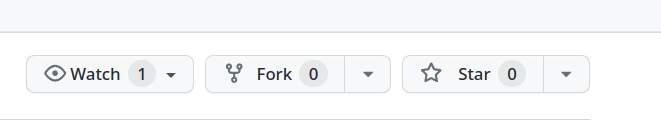
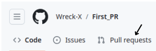
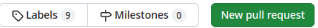

# Welcome to Hacktoberfest 2023!

Begin your Open Source Journey as a contributor by learning to make Pull Requests to a repository. 

# Make your First PR!

1.Fork this repository to your account by clicking the Fork button on this repo.



2.You now have this repo in your github account. You must be able to see it in ```github.com/your-github-username/hacktoberfest-2023``` you can clone the repository.

3.Go ahead and clone this repository from your account to your PC. At this point, make sure you have Git installed in your PC. Refer this documentation from git for instructions. By using the command ```git clone https://github.com/<your-github-username>/hacktoberfest-2023``` you can clone the repository.

4.Open the cloned directory using your system's file manager. You must see a folder called **your_cards** inside this folder you must see a **test.html** file.

5.Make a new html file in the same directory named **your_cards** with your **<github_username>.html** 


6.After doing all these, save the file and close the editor.

7.Now commit your changes by following the below steps

- Open terminal/command prompt inside the cloned folder
- Run `git add .` to stage the file for committing.
- Let's commit! Run `git commit -m "Your commit message"` Get creative with your commit message. You can follow the below format
    - "[your name]: Add me as contributor"
    - For instance: "[Linux]: Add me as contributor"
- Now let's get these changes to your GitHub repo. Run `git push origin master`


8.You are almost done! Now head over to the original repository from which you forked and click on Pull Requests



9.From here, I'll leave you on your own. Make a stunning PR using this flashy green button



10.Google will be your best friend in case you get stuck at any point from now. Now go ahead and make your first cool PR!!