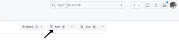

# Welcome to Hacktoberfest 2023!

Begin your Open Source Journey as a contributor by learning to make Pull Requests to a repository. 

# Make your First PR!

1.Fork this repository to your account by clicking the Fork button on this repo.



2.You now have this repo in your github account. You must be able to see it in ```github.com/your-github-username/hacktoberfest-2023``` you can clone the repository.

3.Go ahead and clone this repository from your account to your PC. At this point, make sure you have Git installed in your PC. Refer this documentation from git for instructions. By using the command git clone https://github.com/<your-github-username>/hacktoberfest-20 you can clone the repository.
